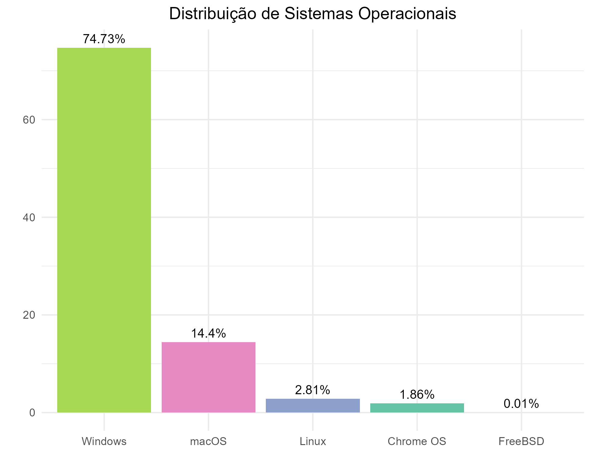

# Sistemas Operacionais

Gráfico sobre a distribuição de popularidade entre sistemas operacionais feito no Rstudio utilizando o pacote ggplot2.

Esse repositório contém o código para a criação do gráfico feito para uma pesquisa sobre o sistema operacional Windows. Foi utilizado em um trabalho acadêmico sobre Sistemas operacionais, em que um dos tópicos foi abordado a comparação entre a popularidade e uso de cada S.O. Para uma melhor experiência, é recomendável a instalação do Rstudio.

Os dados foram extraídos do site: <https://www.tecmundo.com.br/software/266095-microsoft-windows-guia-completo-sistema-operacional.htm>
